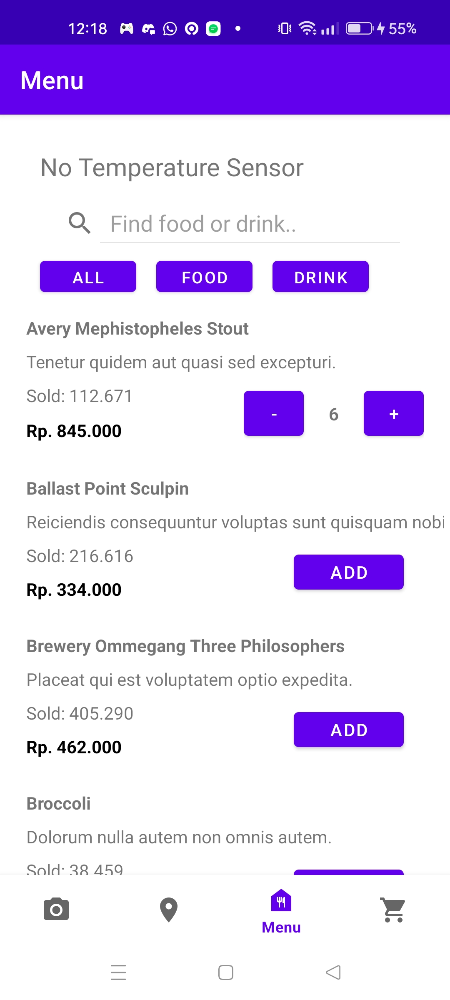
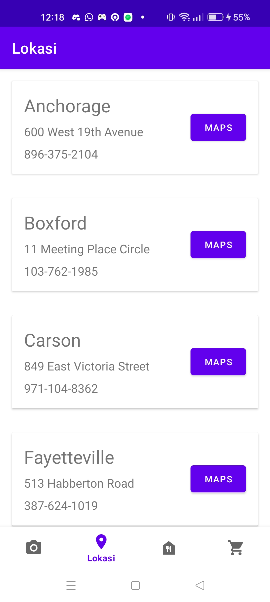

# MajikaUnbound

## Deksripsi Aplikasi

Aplikasi ini merupakan aplikasi untuk membeli makanan dan minuman dengan fitur twibbon yang dapat disimpan

## Library
- CameraX
- Room
- Retrofit
- NavigationX
- Material

| Package |
| ------- |
| `ndroidx.core:core-ktx:1.9.0` |
| `androidx.appcompat:appcompat:1.6.1` |
| `com.google.android.material:material:1.8.0` |
| `androidx.constraintlayout:constraintlayout:2.1.4` |
| `androidx.lifecycle:lifecycle-livedata-ktx:2.5.1` |
| `androidx.lifecycle:lifecycle-viewmodel-ktx:2.5.1` |
| `androidx.navigation:navigation-fragment-ktx:2.5.3` |
| `androidx.navigation:navigation-ui-ktx:2.5.3` |
| `com.squareup.retrofit2:retrofit:2.9.0` |
| `com.squareup.retrofit2:converter-gson:2.9.0` |
| `org.jetbrains.kotlinx:kotlinx-coroutines-core:1.6.4` |
| `org.jetbrains.kotlinx:kotlinx-coroutines-android:1.6.4` |
| `junit:junit:4.13.2` |
| `androidx.test.ext:junit:1.1.5` |
| `androidx.test.espresso:espresso-core:3.5.1` |
| `1.1.0-beta01` |
| `androidx.room:room-runtime:2.5.0"` |
| `androidx.room:room-compiler:2.5.0` |
| `com.google.mlkit:barcode-scanning:17.0.3` |

## Screenshot
### Halaman Menu

### Halaman Keranjang

### Halaman Pembayaran

### Halaman Cabang Restoran

### Halaman Twibbon

## Anggota
Nama                        | NIM
----                        | ---
Dzaky Fattan Rizqullah      | 13520003
Jeremy Rionaldo Pasaribu    | 13520082
Thirafi Najwan Kurniatama   | 13520157

## Pembagian Kerja
Halaman                 | NIM
-------                 | ---
Halaman Menu            | 13520082
Halaman Keranjang       | 13520082, 13520157
Halaman Pembayaran      | 13520157
Halaman Cabang Restoran | 13520003
Halaman Twibbon         | 13520157, 13520003
